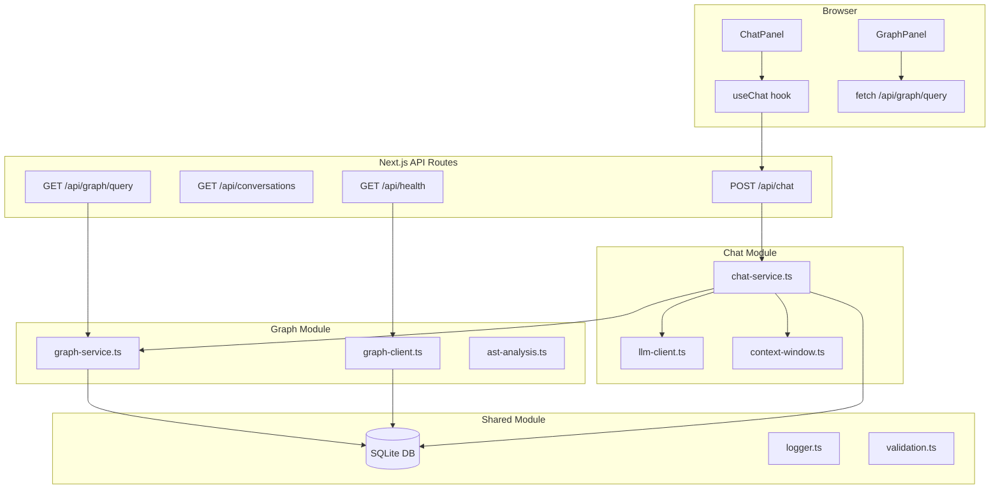

# NeuroDesk AI

[](https://github.com/ajithsai5/neurodesk-ai/actions/workflows/ci.yml)
[](https://github.com/ajithsai5/neurodesk-ai/actions)
[](https://github.com/ajithsai5/neurodesk-ai/security/code-scanning)
[](package.json)
[](LICENSE)
[](https://github.com/ajithsai5/neurodesk-ai/commits/master)
[](https://www.linkedin.com/in/sri-sai-ajith-mandava-ba73a7183/)
[](https://github.com/ajithsai5)

---

NeuroDesk AI is a full-stack AI development assistant that combines **conversational chat**, **document question-answering (RAG)**, and an **in-memory knowledge graph** into a single local-first application. It runs entirely on your machine against Ollama or any cloud LLM provider — no data leaves your network unless you choose a cloud API.

Built with **Next.js 14 App Router**, **TypeScript strict mode**, **Drizzle ORM + SQLite**, and the **Vercel AI SDK**.

---

## Features

| Feature | Name | Description | Status |
|---------|------|-------------|--------|
| F01 | Chat | Multi-conversation chat with persona switching and context window management | ✅ Done |
| F01.5 | Platform Hardening | 90%+ test coverage, CI matrix, CodeQL, Dependabot, knowledge graph module | ✅ Done |
| F02 | Document Q&A (RAG) | Upload documents, semantic search, inline citations | 📋 Planned |
| F03 | Graph-Enhanced RAG | Session graph with code entity indexing and graph-based retrieval re-ranking | 🔄 In Progress |
| F04 | Memory | Persistent session memory across conversations | 📋 Planned |
| F05 | Code Analysis | IDE-style file browsing with AST-powered symbol navigation | 📋 Planned |
| F06 | Agents | Tool-use agents for file operations, web search, shell commands | 📋 Planned |
| F07 | Embeddings | Custom embedding models for domain-specific vector search | 📋 Planned |
| F08 | Collaboration | Multi-user workspaces with shared conversations | 📋 Planned |
| F09 | Plugins | Third-party plugin system for custom tools and data sources | 📋 Planned |

---

## Architecture



Dependencies flow one way: **Components → API Routes → Chat/Graph Modules → Shared Module**. No circular imports.

---

## Knowledge Graph

NeuroDesk AI maintains a session-scoped knowledge graph in SQLite. Every conversation turn creates a **MESSAGE** node; RAG document chunks create **CHUNK** nodes (connected via `PART_OF` edges); TypeScript symbols from the codebase are indexed as **CODE_ENTITY** nodes on startup via the TypeScript compiler API.

The graph powers two features:
1. **Contextual enrichment** — relevant code symbols are appended to the LLM system prompt automatically
2. **RAG re-ranking** — document chunks with stronger graph connections are promoted in retrieval results

### Example queries

```bash
# Empty graph (new conversation)
curl "http://localhost:3000/api/graph/query?conversationId=conv-1&q=test"
# → {"nodes":[],"edges":[]}

# After some messages
curl "http://localhost:3000/api/graph/query?conversationId=conv-1&q=context+window"
# → {"nodes":[{"id":"...","type":"MESSAGE","label":"What is the context window?"}],"edges":[...]}

# Health endpoint with graph stats
curl "http://localhost:3000/api/health"
# → {"status":"ok","timestamp":1745388000000,"graph":{"nodeCount":142,"edgeCount":187,"lastUpdated":1745387900000}}
```

---

## Tech Stack

| Library | Version | Role |
|---------|---------|------|
| [Next.js](https://nextjs.org) | 14.2.35 | Full-stack React framework (App Router) |
| [TypeScript](https://typescriptlang.org) | 5.9.3 | Type-safe language (strict mode) |
| [Drizzle ORM](https://orm.drizzle.team) | 0.45.2 | SQLite schema + type-safe queries |
| [better-sqlite3](https://github.com/WiseLibs/better-sqlite3) | 11.10.0 | Synchronous SQLite driver |
| [Vercel AI SDK](https://sdk.vercel.ai) | 4.3.19 | LLM streaming + provider abstraction |
| [@ai-sdk/openai](https://sdk.vercel.ai/providers/ai-sdk-providers/openai) | 1.3.24 | OpenAI provider |
| [@ai-sdk/anthropic](https://sdk.vercel.ai/providers/ai-sdk-providers/anthropic) | 1.2.12 | Anthropic provider |
| [react-force-graph-2d](https://github.com/vasturiano/react-force-graph) | 1.29.1 | 2D knowledge graph visualization |
| [js-tiktoken](https://github.com/dqbd/tiktoken) | 1.0.21 | Token counting for context window |
| [Zod](https://zod.dev) | 3.25.76 | Runtime schema validation |
| [Vitest](https://vitest.dev) | 3.2.4 | Unit & integration test runner |
| [Playwright](https://playwright.dev) | 1.59.1 | End-to-end browser tests |
| [Tailwind CSS](https://tailwindcss.com) | 3.4.19 | Utility-first CSS |
| [Drizzle Kit](https://orm.drizzle.team/kit-docs/overview) | 0.31.10 | Schema migrations |

---

## Local Setup (Ollama)

**Prerequisites:** Node.js 20, [Ollama](https://ollama.ai) installed with models at `G:\Ollama\Model`

```bash
# 1. Clone
git clone https://github.com/ajithsai5/neurodesk-ai.git
cd neurodesk-ai

# 2. Install dependencies
npm install

# 3. Configure environment
cp .env.example .env
# Ollama requires no API key for local use — no edits needed for default setup

# 4. Pull required Ollama models
ollama pull llama3.1:8b           # Chat generation
ollama pull nomic-embed-text      # Embeddings (used by RAG feature)

# 5. Initialize database
npx drizzle-kit push              # Create all tables (runs in ~1s)
npm run db:seed                   # Seed default personas and providers

# 6. Start
npm run dev
# Open http://localhost:3000
```

---

## Cloud Setup (OpenAI / Anthropic)

Cloud providers require an API key but no local models:

```bash
# In .env, set one of:
OPENAI_API_KEY=sk-...
ANTHROPIC_API_KEY=sk-ant-...
```

Then select the provider in the **Settings** panel. Ollama is not required for cloud providers.

---

## Commands

| Command | Description |
|---------|-------------|
| `npm run dev` | Start Next.js dev server at http://localhost:3000 |
| `npm run build` | Production build |
| `npm run lint` | ESLint on all TypeScript/TSX files |
| `npm test` | Run all Vitest tests (155 tests) |
| `npm run test:watch` | Vitest in watch mode |
| `npm test -- --coverage` | Run tests with V8 coverage report |
| `npm run test:e2e` | Playwright E2E tests |
| `npx drizzle-kit push` | Apply schema to SQLite DB |
| `npm run db:seed` | Seed default personas and providers |

---

## Tests & CI

```bash
npm test                  # 155 unit + integration tests
npm test -- --coverage    # 91%+ statements / branches / functions / lines
npm run test:e2e          # End-to-end via Playwright (requires running dev server)
```

### CI Pipeline (GitHub Actions)

| Job | Node | Description |
|-----|------|-------------|
| `Lint` | 20 | ESLint on all source files |
| `Test (18)` | 18 | Full test suite + coverage upload |
| `Test (20)` | 20 | Full test suite + coverage artifact |
| `Build` | 20 | `npm run build` + `npx tsc --noEmit` |
| `Coverage Comment` | — | Posts coverage delta as PR comment |

**CodeQL** runs weekly (Monday 03:00 UTC) and on every push to `master` for static security analysis.

**Dependabot** opens daily npm PRs (patch bumps auto-merge) and weekly GitHub Actions update PRs.

---

## Contributing

### Branch Naming

```
NNN-feature-name    # e.g. 002.5-platform-hardening
```

### Workflow (speckit)

Follow this order — do not skip steps:

1. `/speckit.specify` — write the feature spec
2. `/speckit.clarify` — resolve open questions
3. `/speckit.plan` — create technical plan, data model, API contracts
4. `/speckit.tasks` — generate the task breakdown
5. `/speckit.analyze` — detect spec/plan/task inconsistencies
6. `/speckit.implement` — execute the task plan

### PR Checklist

- [ ] Tests pass: `npm test`
- [ ] Coverage ≥ 90%: `npm test -- --coverage`
- [ ] No new CodeQL findings
- [ ] Lint clean: `npm run lint`
- [ ] TypeScript clean: `npx tsc --noEmit`
- [ ] Commit messages: `feat/fix/chore/docs: short description`
- [ ] Session handoff updated: `memory/f0NN_session_handoff.md`

---

## License

MIT © 2026 Sri Sai Ajith Mandava — see [LICENSE](LICENSE).
