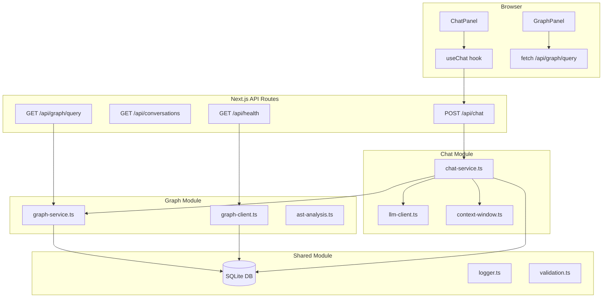

# NeuroDesk AI

[](https://github.com/ajithsai5/neurodesk-ai/actions/workflows/ci.yml)
[](https://github.com/ajithsai5/neurodesk-ai/actions)
[](https://github.com/ajithsai5/neurodesk-ai/actions/workflows/codeql.yml)
[](package.json)
[](LICENSE)
[](https://github.com/ajithsai5/neurodesk-ai/commits/master)
[](https://www.linkedin.com/in/sri-sai-ajith-mandava-ba73a7183/)
[](https://github.com/ajithsai5)

---

NeuroDesk AI is a full-stack AI development assistant that combines **conversational chat**, **document question-answering (RAG)**, and an **in-memory knowledge graph** into a single local-first application. It runs entirely on your machine against Ollama or any cloud LLM provider — no data leaves your network unless you choose a cloud API.

Built with **Next.js 15 App Router**, **TypeScript strict mode**, **Drizzle ORM + SQLite**, and the **Vercel AI SDK**.

---

## Features

| Feature | Name | Description | Status |
|---------|------|-------------|--------|
| F01 | Chat | Multi-conversation chat with persona switching and context window management | ✅ Done |
| F01.5 | Platform Hardening | 95%+ test coverage, CI matrix, CodeQL, Dependabot zero, Graphify integration | ✅ Done |
| F02 | Document Q&A (RAG) | Upload documents, semantic search, inline citations | ✅ Done |
| F02.5 | Platform Hardening II | Graph module, 95% coverage floor, Dependabot zero, CodeQL green | ✅ Done |
| F03 | AI Code Assistant + Graph-Enhanced RAG | Code generation & explanation UI; RAG upgraded to top-20 pool with graph reranking → top-5; Citation graph score badge | ✅ Done |
| F04 | Memory | Persistent session memory across conversations | 📋 Planned |
| F05 | Code Analysis | IDE-style file browsing with AST-powered symbol navigation | 📋 Planned |
| F06 | Agents | Tool-use agents for file operations, web search, shell commands | 📋 Planned |
| F07 | Embeddings | Custom embedding models for domain-specific vector search | 📋 Planned |
| F08 | Collaboration | Multi-user workspaces with shared conversations | 📋 Planned |
| F09 | Plugins | Third-party plugin system for custom tools and data sources | 📋 Planned |

---

## Architecture



Dependencies flow one way: **Components → API Routes → Chat/Graph Modules → Shared Module**. No circular imports.

---

## Knowledge Graph

NeuroDesk AI maintains a session-scoped knowledge graph in SQLite. Every conversation turn creates a **MESSAGE** node; RAG document chunks create **CHUNK** nodes (connected via `PART_OF` edges); TypeScript symbols from the codebase are indexed as **CODE_ENTITY** nodes on startup via the TypeScript compiler API.

The graph powers two features:
1. **Contextual enrichment** — relevant code symbols are appended to the LLM system prompt automatically
2. **RAG re-ranking** — document chunks with stronger graph connections are promoted in retrieval results

### Example queries

```bash
# Empty graph (new conversation)
curl "http://localhost:3000/api/graph/query?conversationId=conv-1&q=test"
# → {"nodes":[],"edges":[]}

# After some messages
curl "http://localhost:3000/api/graph/query?conversationId=conv-1&q=context+window"
# → {"nodes":[{"id":"...","type":"MESSAGE","label":"What is the context window?"}],"edges":[...]}

# Health endpoint with graph stats
curl "http://localhost:3000/api/health"
# → {"status":"ok","timestamp":1745388000000,"graph":{"nodeCount":142,"edgeCount":187,"lastUpdated":1745387900000}}
```

---

## Tech Stack

| Library | Version | Role |
|---------|---------|------|
| [Next.js](https://nextjs.org) | 14.2.35 | Full-stack React framework (App Router) |
| [TypeScript](https://typescriptlang.org) | 5.9.3 | Type-safe language (strict mode) |
| [Drizzle ORM](https://orm.drizzle.team) | 0.45.2 | SQLite schema + type-safe queries |
| [better-sqlite3](https://github.com/WiseLibs/better-sqlite3) | 11.10.0 | Synchronous SQLite driver |
| [Vercel AI SDK](https://sdk.vercel.ai) | 4.3.19 | LLM streaming + provider abstraction |
| [@ai-sdk/openai](https://sdk.vercel.ai/providers/ai-sdk-providers/openai) | 1.3.24 | OpenAI provider |
| [@ai-sdk/anthropic](https://sdk.vercel.ai/providers/ai-sdk-providers/anthropic) | 1.2.12 | Anthropic provider |
| [react-force-graph-2d](https://github.com/vasturiano/react-force-graph) | 1.29.1 | 2D knowledge graph visualization |
| [js-tiktoken](https://github.com/dqbd/tiktoken) | 1.0.21 | Token counting for context window |
| [Zod](https://zod.dev) | 3.25.76 | Runtime schema validation |
| [Vitest](https://vitest.dev) | 3.2.4 | Unit & integration test runner |
| [Playwright](https://playwright.dev) | 1.59.1 | End-to-end browser tests |
| [Tailwind CSS](https://tailwindcss.com) | 3.4.19 | Utility-first CSS |
| [Drizzle Kit](https://orm.drizzle.team/kit-docs/overview) | 0.31.10 | Schema migrations |

---

## Local Setup (Ollama)

**Prerequisites:** Node.js 20, [Ollama](https://ollama.ai) installed with models at `G:\Ollama\Model`

```bash
# 1. Clone
git clone https://github.com/ajithsai5/neurodesk-ai.git
cd neurodesk-ai

# 2. Install dependencies
npm install

# 3. Configure environment
cp .env.example .env
# Ollama requires no API key for local use — no edits needed for default setup

# 4. Pull required Ollama models
ollama pull llama3.1:8b           # Chat generation
ollama pull nomic-embed-text      # Embeddings (used by RAG feature)

# 5. Initialize database
npx drizzle-kit push              # Create all tables (runs in ~1s)
npm run db:seed                   # Seed default personas and providers

# 6. Start
npm run dev
# Open http://localhost:3000
```

---

## Cloud Setup (OpenAI / Anthropic)

Cloud providers require an API key but no local models:

```bash
# In .env, set one of:
OPENAI_API_KEY=sk-...
ANTHROPIC_API_KEY=sk-ant-...
```

Then select the provider in the **Settings** panel. Ollama is not required for cloud providers.

---

## Commands

| Command | Description |
|---------|-------------|
| `npm run dev` | Start Next.js dev server at http://localhost:3000 |
| `npm run build` | Production build |
| `npm run lint` | ESLint on all TypeScript/TSX files |
| `npm test` | Run all Vitest tests (155 tests) |
| `npm run test:watch` | Vitest in watch mode |
| `npm test -- --coverage` | Run tests with V8 coverage report |
| `npm run test:e2e` | Playwright E2E tests |
| `npx drizzle-kit push` | Apply schema to SQLite DB |
| `npm run db:seed` | Seed default personas and providers |

---

## Tests & CI

```bash
npm test                  # 155 unit + integration tests
npm test -- --coverage    # 91%+ statements / branches / functions / lines
npm run test:e2e          # End-to-end via Playwright (requires running dev server)
```

### CI Pipeline (GitHub Actions)

| Job | Node | Description |
|-----|------|-------------|
| `Lint` | 20 | ESLint on all source files |
| `Test (20)` | 20 | Full test suite + coverage upload |
| `Test (22)` | 22 | Full test suite + coverage artifact |
| `Build` | 20 | `npm run build` + `npx tsc --noEmit` |
| `Coverage Comment` | — | Posts coverage delta as PR comment |

**CodeQL** runs weekly (Monday 03:00 UTC) and on every push to `master` for static security analysis.

**Dependabot** opens daily npm PRs (patch bumps auto-merge) and weekly GitHub Actions update PRs.

---

## Contributing

### Branch Naming

```
NNN-feature-name    # e.g. 002.5-platform-hardening
```

### Workflow (speckit)

Follow this order — do not skip steps:

1. `/speckit.specify` — write the feature spec
2. `/speckit.clarify` — resolve open questions
3. `/speckit.plan` — create technical plan, data model, API contracts
4. `/speckit.tasks` — generate the task breakdown
5. `/speckit.analyze` — detect spec/plan/task inconsistencies
6. `/speckit.implement` — execute the task plan

### PR Checklist

- [ ] Tests pass: `npm test`
- [ ] Coverage ≥ 90%: `npm test -- --coverage`
- [ ] No new CodeQL findings
- [ ] Lint clean: `npm run lint`
- [ ] TypeScript clean: `npx tsc --noEmit`
- [ ] Commit messages: `feat/fix/chore/docs: short description`
- [ ] Session handoff updated: `memory/f0NN_session_handoff.md`

---

---

## Why this project exists

**The problem.** Every AI coding assistant on the market today (Cursor, Claude Code, ChatGPT, Continue, Aider) sits behind a SaaS endpoint. Your code, your prompts, your conversation history — they all leave your machine. For developers working on proprietary code, regulated data, or anything they would rather not see indexed by a third party, the answer is usually "don't use AI" or "use the slow self-hosted thing." Neither is satisfying.

**The target user.** A solo developer or small team who:
- already runs **Ollama** locally and has decent embeddings + 8B-class chat models
- wants the same conversational experience as ChatGPT but pointed at their own files
- needs to ground answers in their actual documents (RAG) and their actual codebase (graph)
- is comfortable in TypeScript and would rather extend a small stack than fight a plugin system

**Alternatives considered.**

| Tool | Why it didn't fit |
|------|-------------------|
| **Cursor / GitHub Copilot** | Always cloud-bound; can't be pointed at a private LLM; opinionated UX you can't reshape. |
| **Claude Code (the CLI)** | Excellent for repo-level work but doesn't give you a multi-conversation chat UI or document Q&A. NeuroDesk is a complementary surface that *uses* Claude Code's protocols (MCP, hooks). |
| **ChatGPT Code Interpreter** | Web-only, no local model, no codebase indexing, no offline mode. |
| **Continue.dev** | Closest in spirit but ships as a VS Code extension; we wanted a standalone web app you can run on a laptop and hit from any browser. |
| **Custom RAG stacks (LangChain + Pinecone)** | Enormous dependency surface for a single-user tool; production-grade infra you don't need. SQLite + sqlite-vec covers the same ground in <100 LoC of glue. |

**The shape of the answer.** A single Next.js process. SQLite for storage. A Vercel-AI-SDK wrapper that works against Ollama, OpenAI, or Anthropic. RAG over PDFs and text. A knowledge graph (built two ways — in-DB for sessions + Graphify static analysis for code) that grounds the model in real symbols. CI matrix on Node 20 + 22, 95%+ coverage, CodeQL, zero open Dependabot alerts, MIT license.

---

## Per-file Index (`src/`)

Every TypeScript file under `src/`, what it does, and the public symbols it exports. Generated alongside the Graphify pass and hand-curated so it stays accurate as the tree grows.

### `src/app/` — Next.js App Router entrypoint

| File | Purpose | Public exports |
|------|---------|----------------|
| `app/layout.tsx` | Root HTML layout, font loader, global CSS | `RootLayout` (default) |
| `app/page.tsx` | Home page — top-level shell that mounts `Sidebar` + `ChatPanel` | `Home` (default) |

### `src/app/api/` — Route handlers (server-only)

| File | Purpose | Public exports |
|------|---------|----------------|
| `api/chat/route.ts` | POST — primary chat endpoint; streams LLM response via Vercel AI SDK | `POST` |
| `api/conversations/route.ts` | GET (list) + POST (create) conversation records | `GET`, `POST` |
| `api/conversations/[id]/route.ts` | GET (single), PATCH (rename), DELETE (cascade) one conversation | `GET`, `PATCH`, `DELETE` |
| `api/conversations/[id]/archive/route.ts` | POST — soft-archive a conversation (sets `status='archived'`) | `POST` |
| `api/documents/route.ts` | GET (list) + POST (upload + ingest) RAG documents | `GET`, `POST` |
| `api/documents/[id]/route.ts` | GET (single) + DELETE one document and its chunks | `GET`, `DELETE` |
| `api/personas/route.ts` | GET — list seeded personas (read-only in v1) | `GET` |
| `api/providers/route.ts` | GET — list configured LLM providers | `GET` |
| `api/graph/query/route.ts` | GET — query the in-DB knowledge graph for a session | `GET` |
| `api/health/route.ts` | GET — liveness probe + graph stats (nodeCount, edgeCount, lastUpdated) | `GET` |

### `src/components/` — React UI

| File | Purpose | Public exports |
|------|---------|----------------|
| `components/ErrorBoundary.tsx` | Catches React subtree errors; renders fallback UI | `ErrorBoundary` |
| `components/ModelSwitcher.tsx` | Dropdown for picking the active LLM provider/model | `ModelSwitcher` |
| `components/PersonaSelector.tsx` | Dropdown for picking the active persona (system prompt) | `PersonaSelector` |
| `components/GraphPanel.tsx` | Force-directed graph view of the current session's nodes/edges | `GraphPanel` |
| `components/CitationPanel.tsx` | Inline citations rendered alongside RAG answers | `CitationPanel` |
| `components/DocumentLibrary.tsx` | Lists ingested RAG documents with status + delete | `DocumentLibrary` |
| `components/DocumentStatus.tsx` | Per-document ingestion status badge | `DocumentStatus` |
| `components/DocumentUpload.tsx` | Drag-and-drop file upload → POST `/api/documents` | `DocumentUpload` |
| `components/chat/ChatPanel.tsx` | Top-level chat surface; wraps `useChat` hook + message list + input | `ChatPanel` |
| `components/chat/MessageInput.tsx` | Multiline textarea with 10k-char guard + Enter-to-send | `MessageInput` |
| `components/chat/MessageList.tsx` | Renders user + assistant message bubbles, scroll-to-bottom on new | `MessageList` |
| `components/chat/StreamingMessage.tsx` | Renders the in-flight assistant message as tokens arrive | `StreamingMessage` |
| `components/sidebar/Sidebar.tsx` | Conversation list rail; renders `ConversationItem`s | `Sidebar` |
| `components/sidebar/ConversationItem.tsx` | One row in the sidebar — title, date, archive/delete actions | `ConversationItem` |

### `src/modules/chat/` — Chat domain logic

| File | Purpose | Public exports |
|------|---------|----------------|
| `chat/chat-service.ts` | `handleChatMessage` orchestrator: validate → load persona → graph + Graphify enrich → context-window → stream | `handleChatMessage` |
| `chat/llm-client.ts` | Provider abstraction over Vercel AI SDK (OpenAI / Anthropic / Ollama) | `getLLMModel`, `streamChatResponse` |
| `chat/context-window.ts` | Hybrid trim — last N messages, then trim to token cap with `js-tiktoken` | `applyContextWindow`, `countTokens` |
| `chat/types.ts` | `ChatRequest`, `ChatMessage` interfaces | type-only |
| `chat/index.ts` | Module barrel — re-exports the public surface | re-exports |

### `src/modules/graph/` — Knowledge graph

| File | Purpose | Public exports |
|------|---------|----------------|
| `graph/graph-service.ts` | High-level graph API: `writeConversationNode`, `queryCodeEntities`, `cascadeDeleteConversation`, `rerankWithGraph` | the named functions above |
| `graph/graph-client.ts` | Low-level Drizzle wrapper: `getGraphStats`, `queryGraph`, `writeChunkNodes` | the named functions above |
| `graph/ast-analysis.ts` | TypeScript Compiler API pass that seeds CODE_ENTITY nodes on startup | `initAstAnalysis` |
| `graph/graphify-bridge.ts` | Reads `graphify-out/graph.json` and exposes substring queries to chat-service | `loadGraphifyIndex`, `queryGraphifyEntities`, `resetGraphifyCache` |
| `graph/types.ts` | `GraphNode`, `GraphEdge`, `GraphQueryResult`, `CodeEntity`, `GraphStats` | type-only |
| `graph/index.ts` | Module barrel | re-exports |

### `src/modules/rag/` — Document Q&A pipeline

| File | Purpose | Public exports |
|------|---------|----------------|
| `rag/document-service.ts` | DB CRUD for documents — `createDocument`, `getDocument`, `listDocuments`, `deleteDocument`, `findByHash`, `updateDocumentStatus` | the named functions above |
| `rag/ingestion-pipeline.ts` | End-to-end ingest: extract → chunk → embed → store → write graph nodes | `ingestDocument` |
| `rag/embedding-client.ts` | Ollama `nomic-embed-text` wrapper with retry + typed errors | `generateEmbedding`, `EmbeddingError` |
| `rag/retrieval-service.ts` | Vector search over `sqlite-vec` + graph re-rank + citation formatting | `retrieveChunks`, `formatRagContext`, `formatCitations` |
| `rag/pdf-extractor.ts` | PDF → page text via `pdf-parse/lib/pdf-parse.js` subpath | `extractPages`, `loadPdfParse` |
| `rag/txt-extractor.ts` | Plain-text reader (UTF-8, with BOM stripping) | `extractTextFile` |
| `rag/index.ts` | Module barrel | re-exports |

### `src/modules/shared/` — Cross-cutting infrastructure

| File | Purpose | Public exports |
|------|---------|----------------|
| `shared/db/index.ts` | better-sqlite3 singleton + Drizzle handle (WAL mode, FK on) | `db` |
| `shared/db/schema.ts` | Drizzle schema — `conversations`, `messages`, `personas`, `provider_configs`, `documents`, `chunks`, `graph_nodes`, `graph_edges` | all table consts |
| `shared/db/seed.ts` | One-shot seed for default personas + providers | `seed` (CLI entry) |
| `shared/logger.ts` | Structured JSON logger with test-mode suppression | `logger` |
| `shared/validation.ts` | Zod schemas + helpers for API input | `chatRequestSchema`, etc. |
| `shared/types.ts` | App-wide shared types | type-only |
| `shared/index.ts` | Module barrel | re-exports |

### `src/lib/` and `src/types/`

| File | Purpose | Public exports |
|------|---------|----------------|
| `lib/config.ts` | Runtime config (context window size, token cap) | `config` |
| `types/pdf-parse.d.ts` | Ambient declaration for the `pdf-parse/lib/pdf-parse.js` subpath import | type-only |

---

## Per-function API

The public surface of each module — function signatures and a one-line "what it does" so contributors can scan without reading the whole tree. Internal helpers are intentionally omitted.

### `@/modules/chat`

```ts
// Orchestrate a chat turn end-to-end. Returns a Vercel AI SDK stream result.
handleChatMessage(input: ChatRequest): Promise<StreamResult>

// Resolve a provider-name string to a concrete Vercel AI SDK model instance.
getLLMModel(providerName: string, modelId: string): LanguageModelV1

// Stream a chat completion through the chosen provider. Wraps streamText().
streamChatResponse(args: { providerName, modelId, systemPrompt, messages }): Promise<StreamResult>

// Hybrid context-window trim: last N messages then trim by token cap.
applyContextWindow(messages: ChatMessage[], opts: { maxMessages, maxTokens }): ChatMessage[]

// Token count via js-tiktoken (cl100k_base, gpt-4o encoding).
countTokens(text: string): number
```

### `@/modules/graph`

```ts
// In-DB graph (per session)
writeConversationNode(conversationId, sessionId, label): Promise<void>
queryCodeEntities(conversationId, query): Promise<GraphNode[]>     // CODE_ENTITY nodes only
queryGraph(sessionId, query): Promise<GraphQueryResult>            // mixed types
cascadeDeleteConversation(conversationId): Promise<void>
getGraphStats(): Promise<GraphStats>                               // { nodeCount, edgeCount, lastUpdated }
rerankWithGraph(candidates, sessionId): Promise<RerankedChunk[]>   // RAG re-rank by graph weight
writeChunkNodes(documentId, chunkIds): Promise<void>

// Graphify static graph (read-only, loaded from graphify-out/graph.json)
loadGraphifyIndex(): GraphifyGraph | null                          // null on missing/corrupt
queryGraphifyEntities(query: string, limit?: number): GraphifyMatch[]
resetGraphifyCache(): void                                         // test-only

// Startup AST extraction (runs once at server boot)
initAstAnalysis(): Promise<void>
```

### `@/modules/rag`

```ts
// Document lifecycle
createDocument(args): Promise<Document>
getDocument(id): Promise<Document | null>
listDocuments(): Promise<Document[]>
deleteDocument(id): Promise<void>
findByHash(sha256): Promise<Document | null>                        // dedupe upload
updateDocumentStatus(id, status): Promise<void>

// Ingestion
ingestDocument(args: { id, buffer, mime, filename }): Promise<void> // extract → chunk → embed

// Retrieval
retrieveChunks(query: string, k?: number): Promise<RetrievedChunk[]>
formatRagContext(chunks): string                                   // → system-prompt prefix
formatCitations(chunks): Citation[]                                // → UI panel

// Embedding
generateEmbedding(text: string): Promise<number[]>                 // Ollama nomic-embed-text
class EmbeddingError extends Error { /* typed for retry logic */ }

// Extraction
extractPages(buffer: Buffer): Promise<{ page: number; text: string }[]>
extractTextFile(buffer: Buffer): Promise<string>
```

### `@/modules/shared`

```ts
db                            // Drizzle handle bound to better-sqlite3
logger.info / warn / error / debug(msg, meta?): void
chatRequestSchema             // Zod schema, validates POST /api/chat body
config: { contextWindowSize, contextTokenCap, ... }
```

---

## Progression Changelog

How NeuroDesk got here, feature by feature, with the technical milestone for each.

### F00 — Bootstrap (initial commit)

Spun up Next.js 14 App Router + TypeScript strict + Tailwind + ESLint. Wired Vitest with `@/` path alias matching `tsconfig.json`. Repo conventions: `feat/fix/chore/docs:` commit prefixes, `NNN-feature-name` branch names, `memory/fNN_session_handoff.md` per-feature handoff files.

### F01 — Conversational chat (Vercel AI SDK + Drizzle)

- SQLite via `better-sqlite3` + Drizzle ORM (WAL, foreign keys on).
- Four tables: `conversations`, `messages`, `personas`, `provider_configs`.
- `chat-service.ts` orchestrator + `llm-client.ts` provider abstraction (OpenAI, Anthropic, Ollama via OpenAI-compatible shim).
- Hybrid context window: trim to last 20 messages, then trim oldest until under 100K-token cap (`js-tiktoken`, cl100k_base).
- Streaming via `streamText().toDataStreamResponse()` → SSE to the React `useChat` hook.
- Persona-driven system prompts (admin-managed, read-only in v1).

**Milestone**: end-to-end chat round-trip, Ollama → SSE → DOM, in <300 ms first token on `llama3.1:8b`.

### F01.5 — Platform hardening ✅ merged

- Vitest coverage with V8 reporter, ≥ 90% gate enforced in CI on every PR.
- CI matrix: Node 20 + 22 jobs (lint, test, build, CodeQL).
- `npx tsc --noEmit` step added so type errors in test files fail the build.
- CodeQL Advanced workflow (matrix: actions + javascript-typescript, v4 actions).
- Dependabot daily npm + weekly actions; auto-merge for patch bumps.
- Pinned dependency policy: exact versions in `dependencies`, patch-range in `devDependencies`.
- In-DB knowledge graph (`graph_nodes`, `graph_edges` tables) with cascade-delete on conversation removal.
- Graph-enriched chat: `queryCodeEntities()` matches are appended to the system prompt.
- `GET /api/graph/query` and `GET /api/health` (with graph stats).
- `GraphPanel.tsx` force-directed visualization (`react-force-graph-2d`).

**Milestone**: green CI on Node 20 + 22, 90%+ coverage, zero high CodeQL findings, Dependabot configured.

### F02 — Document Q&A (RAG)

- PDF + plain-text ingestion (`pdf-parse/lib/pdf-parse.js` subpath to dodge the self-test crash).
- Chunking with overlap (1000-char windows, 200-char stride).
- Embeddings via Ollama `nomic-embed-text` (768-dim).
- Vector search via `sqlite-vec` extension (cosine similarity).
- RAG context prepended to system prompt; citation panel renders inline.
- 50 new tests (chunker, embedding-client, retrieval-service, documents-api).
- Schema additions: `documents`, `chunks`, plus `graph_nodes` extended with `CHUNK` type.

**Milestone**: upload a PDF, ask a question, get a grounded answer with page-level citations.

### F02.5 — Gap closure ✅ merged (PR #10)

Four gaps surfaced after F01.5 merged were closed here:

- **Coverage 90% → 95%**: backfilled tests for `graph-client`, `graph-service`, `chat/route`, `GraphPanel`, `ChatPanel`, `MessageList`, `MessageInput`. 274 tests passing. Threshold raised in `vitest.config.mts`.
- **Dependabot zero**: `esbuild` ≥ 0.25.0 and `postcss` ≥ 8.5.10 via npm `overrides`; `uuid` 11 → 14; `next` 14 → 15.5.15; 19 Dependabot PRs triaged (5 merged, 14 closed with rationale).
- **Graphify integrated**: `pip install graphifyy`; `graphify update src` → 111 nodes, 110 edges, 35 communities; `graphify claude install` wires PreToolUse hook + CLAUDE.md directive; `graphify-bridge.ts` enriches every chat system prompt with matched code entities from the static graph.
- **README expanded**: per-file index, per-function API reference, progression changelog, Graphify setup guide.

**Milestone**: merged to master, CI green on Node 20 + 22, 95.43% branch coverage, zero open Dependabot alerts, CodeQL clean.

### F03 — Graph-enhanced RAG 🔄 next

Connect the graph layer to the RAG retrieval path end-to-end:

- `writeChunkNodes()` — log retrieved chunks as `CHUNK` nodes after each RAG query (already implemented, needs to be called in retrieval path).
- `rerankWithGraph()` — reorder candidates by graph edge-weight score before injecting into the LLM prompt (implemented, needs wiring).
- Eval harness: baseline answer-relevance score vs. graph-reranked score to confirm SC-008 (≥10% lift).
- Dependency upgrades deferred from F02.5: `drizzle-orm`, `vitest/coverage-v8`, `pdf-parse`, `@types/node`, `react-dom`, `eslint` — all to be validated against the feature branch before landing on master.

---

## Graphify (knowledge-graph dev tool + chat enrichment)

This project ships with [Graphify](https://github.com/safishamsi/graphify) wired in two ways:

1. **Claude Code dev tool**: a PreToolUse hook in `.claude/settings.json` makes Claude consult `graphify-out/GRAPH_REPORT.md` before every Glob/Grep call — typically 49–71× fewer tokens per question on architecture queries.
2. **Chat retrieval enrichment**: `src/modules/graph/graphify-bridge.ts` reads `graphify-out/graph.json` and the chat service substring-matches the user's message against it, appending matches to the LLM system prompt as a "Graphify Knowledge Graph" section.

### Setup (one-time per machine)

```bash
# Graphify is a Python tool — install via pip (or pipx if you prefer isolation)
pip install graphifyy

# Build the graph against src/
npm run graphify:build           # alias for `graphify update src`

# Wire the Claude Code hook (writes CLAUDE.md section + .claude/settings.json hook)
graphify claude install
```

The build produces:

- `graphify-out/graph.json` — committed to the repo (used by chat enrichment).
- `graphify-out/GRAPH_REPORT.md` — committed; lists god nodes, communities, suggested questions.
- `graphify-out/graph.html`, `cache/`, `transcripts/` — gitignored.

### Example queries

```bash
# Plain-language node explanation
graphify explain "handleChatMessage"

# Shortest path between two symbols
graphify path "POST" "ingestDocument"

# Question-answering BFS over the graph
graphify query "Where is the chat persona system prompt assembled?"
```

### Current snapshot

```
111 nodes · 110 edges · 35 communities
God nodes: GET (18 edges), POST (12), ingestDocument (9), DELETE (7), handleChatMessage (6)
```

---

## License

MIT © 2026 Sri Sai Ajith Mandava — see [LICENSE](LICENSE).
